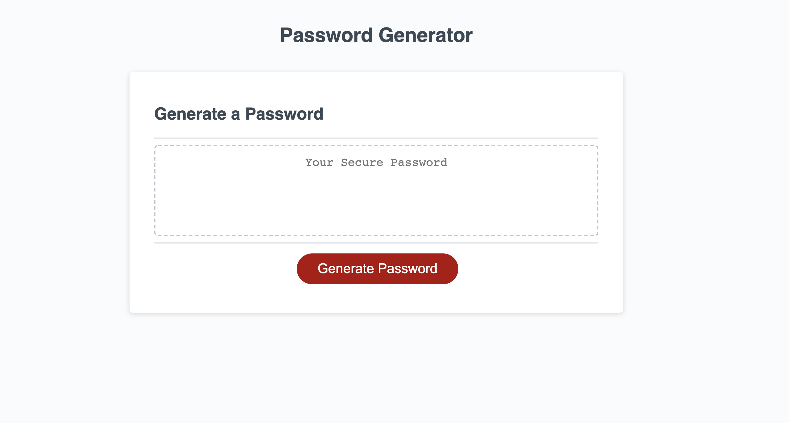
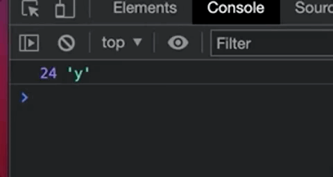

# KeyWord-Enforcer

Need a super strong secure password?
With this password generator you get to choose the length and characteristics of your passphrase all whille still having it be secure!

---

## Table of Contents

* [Built with](#builtwith)
* [Live link](#deployedlink)
* [Site Layout](#layout)
* [Functionality](#functionality)
* [Learning points](#learningpoints )

---
## Built With

* [HTML](https://developer.mozilla.org/en-US/docs/Web/HTML)
* [CSS](https://developer.mozilla.org/en-US/docs/Web/CSS)
* [Javascript](https://developer.mozilla.org/en-US/docs/Web/JavaScript)
---
## Deployed Link

* [Password generator](#)



---

## Layout

The page lay out is really simple in terms of CSS. Thiers a header, text area , and a button.

---

## Functionality

### prompts 

When you press on the "Generate password" button a series of window prompts will appear asking for the users inputs to customize the passphrase. 


### Error

If user doesn't put a valid response, the system will regonize the user's input and ask them to enter a valid response. 


### Random selector 

using Math.floor(Math.random() we are able have the console make a random selection of an array. 
```javascript
var alpab = ['a', 'b', 'c', 'd', 'e', 'f', 'g', 'h', 'i', 'j', 'k', 'l', 'm', 'n', 'o', 'p', 'q', 'r', 's', 't', 'u', 'v', 'w', 'x', 'y', 'z'];
var random = Math.floor(Math.random() * alpab.length);
console.log(random, alpab[random])
   
```



---

### Learning points 

In this project I learned how to make a static page become dynamic through javascript. I learned the use of window/prompts/alerts/confirm. I also learned the use "if & else" statments. I also learned how pseudocode can help me have a plan of attack when it comes to writing algorithms. I do plan on furthering my knowledge so that I'll have the console validate the user inputs to execute and filter the selected prompts. 

---

## License
for UC Berkely Extention bootcamp program

---
##### Author Joshua Meza
[GitHub](https://github.com/705h-S)